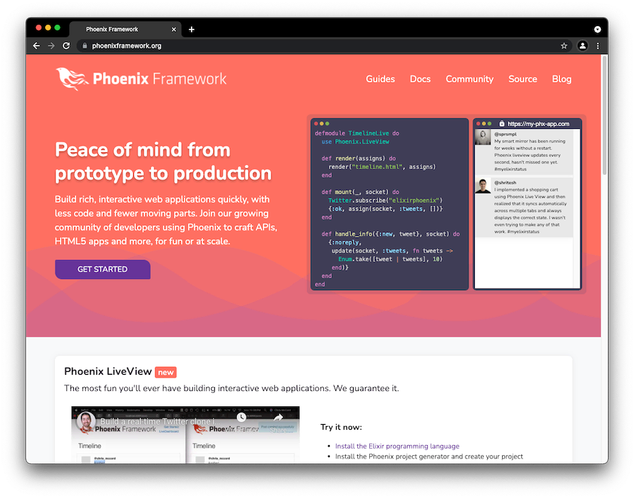
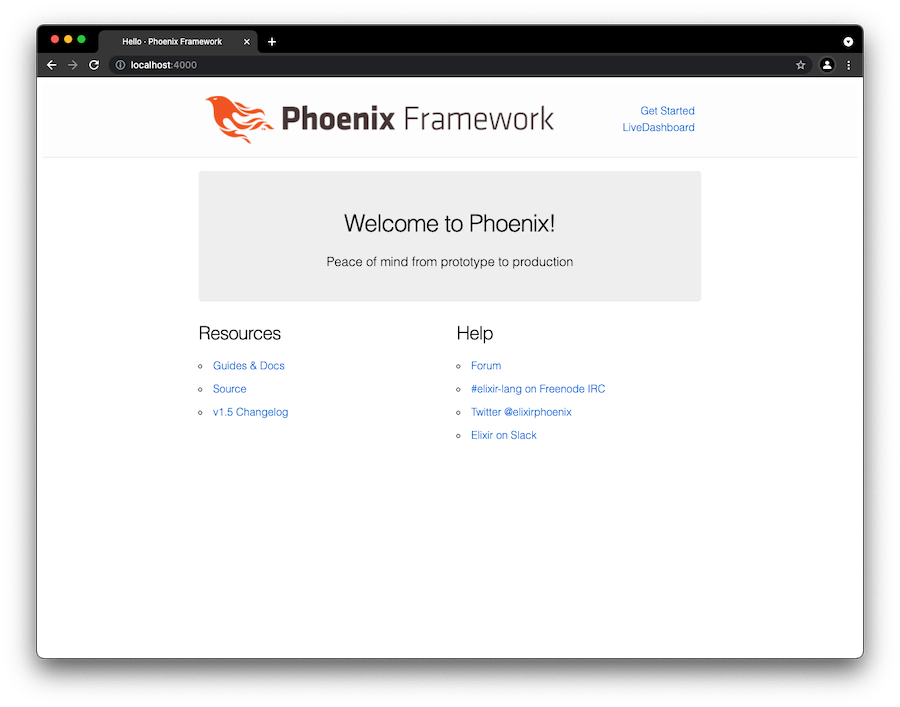

이번 글에서는 Phoenix 로 local 에 web server 를 띄워보겠습니다.\
이후에 Phoenix 에 블로그 기능을 추가하고, 개선하고, 배포하는 것도 작성할 예정입니다.

이 글은 앞서 적었던 [Elixir 개발 환경을 설정해봅시다 (Mac)](./20210816_how_to_setup_elixir_dev_env_on_mac.md) 로 Elixir 로 개발할 수 있는 환경을 설정했음을 전제로 합니다.

참고 code: [github/nallwhy/json-media](https://github.com/nallwhy/json-media/commit/479a44a466fb7ca79244f653303c99690d99392d)


## Phoenix 설치

[Phoenix](https://phoenixframework.org/) 는 Elixir 로 만들어진 web framework 로, Elixir 의 **Concurrency**, **Reliability**, **Productivity** 등 여러 장점을 고스란히 활용하고 있습니다.



나중에 **Why Phoenix?** 라는 글로 Phoenix 의 장점들을 정리해보도록 하겠습니다.\
일단은 실전!

Phoenix 설치 과정은 [Phoenix - Installation](https://hexdocs.pm/phoenix/installation.html) 을 참고했습니다.

### Hex package manager 설치

Phoenix 를 설치하기에 앞서 Hex 를 설치합니다. [Hex](https://hex.pm/) 는 Erlang ecosystem 에서 사용되는 package manager 로, Phoenix 를 설치하기 위해서 필요합니다.

```shell
$ mix local.hex
```

### Phoenix application generator 설치

이제 Phoenix 프로젝트를 생성해주는 Phoenix application generator 를 설치합니다. 현재 기준 Phoenix 의 최신버전은 1.5.12 입니다.

```shell
$ mix archive.install hex phx_new 1.5.12
```

최신 버전은 [Hex - phoenix](https://hex.pm/packages/phoenix) 에서 찾을 수도 있고, 더 간단하게는 아래와 같이 mix task 를 통해서도 확인할 수 있습니다.\
(1.6.0 이 rc 단계네요. 기대기대!)

```shell
$ mix hex.info phoenix

Productive. Reliable. Fast. A productive web framework that
does not compromise speed or maintainability.

Config: {:phoenix, "~> 1.5"}
Releases: 1.6.0-rc.0, 1.5.12, 1.5.11, 1.5.10, 1.5.9, 1.5.8, 1.5.7, 1.5.6, ...

Licenses: MIT
Links:
  GitHub: https://github.com/phoenixframework/phoenix
```


## Phoenix 프로젝트 생성

이제 Phoenix 설치가 끝났으니, Phoenix 프로젝트를 생성해보겠습니다.

Phoenix 프로젝트 생성 과정은 [Phoenix - Up and Running](https://hexdocs.pm/phoenix/up_and_running.html) 을 참고했습니다.

### Phoenix 프로젝트 구성

Phoenix 프로젝트를 생성하기에 앞서 Phoenix 프로젝트가 어떤 식으로 구성되는지 알아보겠습니다. 일단 프로젝트를 생성한 다음에 봐도 무관합니다.

Phoenix 는 web framework 이고, web server 역할을 하기 위해서는 추가적인 기능이 필요하기 때문에 일반적으로 여러가지가 같이 설치됩니다.

- [webpack](https://webpack.js.org/)

    Phoenix 는 asset 관리를 위해 이미 널리 사용되고 있는 webpack 을 사용합니다.\
    (Phoenix 1.6 부터는 webpack 대신 [esbuild](https://esbuild.github.io/) 을 사용합니다. 이유는 [FYI: Phoenix drops webpack and npm for esbuild](https://fly.io/blog/phoenix-moves-to-esbuild-for-assets/) 에서 확인하실 수 있습니다.)
    
- [Ecto](https://github.com/elixir-ecto/ecto)

    Elixir 에서는 data mapping 을 위해 주로 Ecto 를 사용합니다. 제가 Elixir 를 쓰는 이유 중 큰 부분을 차지하고 있고, 다른 언어에서 비슷한 기능을 하는 툴들은 비교가 불가능할 정도로 압도적입니다.\
    Elixir 진영에서는 database 로 주로 PostgreSQL 을 사용합니다.

- [Phoenix LiveView](https://github.com/phoenixframework/phoenix_live_view)

    아직은 Phoenix 기본 구성이 아니지만, Phoenix 1.6 부터 기본 구성으로 추가될 예정이라 소개합니다. server side rendering 방식으로 Javascript 없이 SPA 와 같은 웹 페이지를 만든다고 생각하시면 됩니다. 나중에 static 한 페이지를 Live View 로 변경하는 과정을 블로그로 작성하면서 자세히 설명해보겠습니다.

- [Phoenix LiveDashboard](https://github.com/phoenixframework/phoenix_live_dashboard)

    Phoenix LiveView 를 기반으로 web server 를 실시간으로 monitoring 할 수 있습니다. 이것도 나중에 자세히 설명해보겠습니다.

위의 구성들은 Phoenix 프로젝트를 만들면서 포함할 수도, 제외할 수도 있습니다. 이번에는 아직 기본 구성이 아닌 Phoenix LiveView 를 제외한 기본 설정으로 프로젝트를 생성해보겠습니다.

### Phoenix 프로젝트 생성

이제 `mix phx.new` mix task 를 이용해 Phoenix 프로젝트를 생성해보겠습니다.\
프로젝트 이름은 `hello` 입니다.

```shell
$ mix phx.new hello --umbrella

* creating hello_umbrella/.gitignore
* creating hello_umbrella/config/config.exs
...
* creating hello_umbrella/apps/hello/priv/repo/seeds.exs
* creating hello_umbrella/apps/hello/test/support/data_case.ex

Fetch and install dependencies? [Yn]
```

`Y` 를 선택하면 Elixir, Javascript dependency 들을 바로 설치해줍니다.

```shell
Fetch and install dependencies? [Yn]
* running mix deps.get
* running mix deps.compile
* running cd apps/hello_web/assets && npm install && node node_modules/webpack/bin/webpack.js --mode development

We are almost there! The following steps are missing:

    $ cd hello_umbrella

Then configure your database in config/dev.exs and run:

    $ mix ecto.create

Start your Phoenix app with

    $ mix phx.server

You can also run your app inside IEx (Interactive Elixir) as:

    $ iex -S mix phx.server
```

`./hello_umbrella` 에 Phoenix 프로젝트가 생겼습니다.

위 명령에서 `--umbrella` 어떤 역할을 할까요?\
Elixir 는 여러 app 을 역어 하나의 app 처럼 운영하는 것이 built-in 으로 지원됩니다.

`./hello_umbrella/apps` 를 보면 `hello`, `hello-web` 두 개의 app 이 생긴 것을 확인할 수 있습니다.

```shell
$ ls
hello hello-web
```

`hello` 는 domain 영역을 담당하고 `hello-web` 은 web interface 영역을 담당합니다.

개인적으로 domain 영역과 web interface 영역이 섞이는 것을 매우 싫어하기 때문에 항상 umbrella 프로젝트로 만들어서 사용하고 있습니다.

`mix phx.new` mix task 에 대한 설명은 [mix phx.new](https://hexdocs.pm/phoenix/Mix.Tasks.Phx.New.html) 에서 확인하실 수 있습니다.

umbrella 프로젝트에 대해서는 [Elixir - Umbrella Projects](https://elixir-lang.org/getting-started/mix-otp/dependencies-and-umbrella-projects.html#umbrella-projects) 에서 자세히 알아보실 수 있습니다.

### Database 설정

#### PostgreSQL 설정

`mix phx.new` 를 할 때 Ecto 를 사용하도록 구성했기 때문에 database 를 띄워야 합니다.\
PostgreSQL 을 직접 설치하거나, Docker Compose 를 이용해서 띄우는 것이 일반적입니다.

Brew 를 이용한다면 [이 문서](https://formulae.brew.sh/formula/postgresql) 를,\
Docker Compose 를 이용한다면 [이 commit](https://github.com/nallwhy/json-media/commit/0f4aa5e486503344848005120a09a095ac917cdd) 을 참고해주세요.

#### Database 초기화

PostgreSQL 을 성공적으로 실행했다면 `mix ecto.create` mix task 로 database 를 생성하고 초기화 해줍니다.

```shell
$ mix ecto.create

==> hello
Compiling 3 files (.ex)
Generated hello app
==> hello_web
Compiling 12 files (.ex)
...

Generated hello_web app
The database for Hello.Repo has been created
```


## Phoenix web server 실행

이제 만들어진 Phoenix project 로 web server 를 local 에서 띄워봅시다.

```shell
$ iex -S mix phx.server

Erlang/OTP 24 [erts-12.0.2] [source] [64-bit] [smp:8:8] [ds:8:8:10] [async-threads:1] [jit]

[info] Running HelloWeb.Endpoint with cowboy 2.9.0 at 0.0.0.0:4000 (http)
[info] Access HelloWeb.Endpoint at http://localhost:4000
Interactive Elixir (1.12.1) - press Ctrl+C to exit (type h() ENTER for help)
iex(1)>
webpack is watching the files…
...
```

위 명령어는 Elixir 의 interactive shell 인 `IEx` 안에서 Phoenix web server 를 실행해줍니다.

이제 웹 브라우저에서 `http://localhost:4000` 로 접속해서 web server 가 잘 실행되었는지 확인해봅시다.




## 마무리

Phoenix 프로젝트를 생성하고 local 에서 web server 을 실행해보았습니다.\
설명은 길었지만 막상 실행한 명령어를 보면 아래 5개이고, 초기 설정을 제외한 실제 프로젝트 생성은 명령어 3개로 끝납니다.

```shell
# Hex 설치
$ mix local.hex

# Phoenix application generator 설치
$ mix archive.install hex phx_new 1.5.12

# Phoenix 프로젝트 생성
$ mix phx.new hello --umbrella

# datbase 초기화
$ mix ecto.create

# Phoenix web server 실행
$ iex -S mix phx.server
```

다음에는 Phoenix 프로젝트에 블로그 기능을 추가해보도록 하겠습니다.

읽어주셔서 감사합니다!
